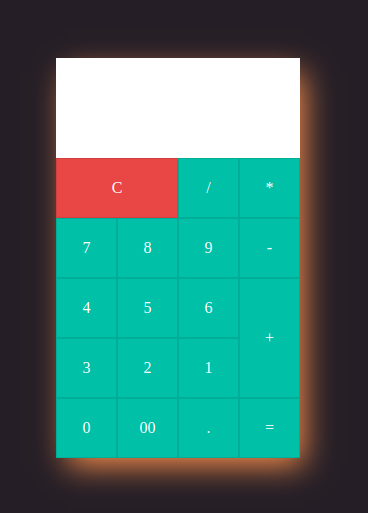
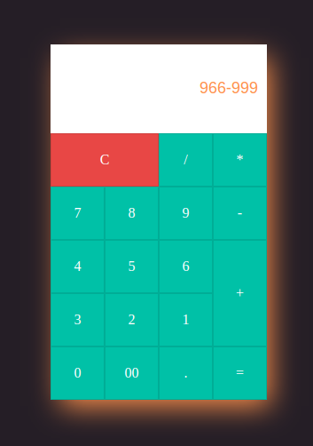

# Calculado_JavaScript_Puro

------------

### Projeto Calculado usando HTML, CSS, JavaScript Puro

Neste projeto estou criando um script para uma calculadora usando **JavaScript** Com conhecimentos que eu adquiri em um curso feito a um tempo atrás de Java e     com aulas que tive de Java na minha escola ETEC Zona Leste, com ajuda também do curso de JavaScript online feito pela Impacta e com auxilio de amigos.

------------

